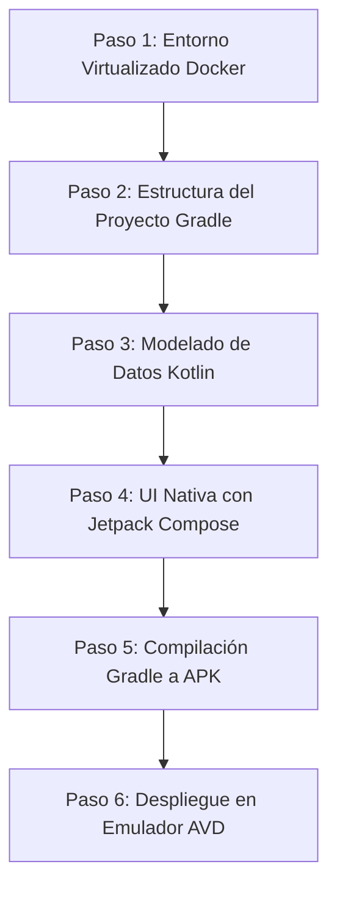

# GUÍA TÉCNICA: CONCEPTO, DESARROLLO E IMPLEMENTACIÓN DE APLICACIONES NATIVAS ANDROID

---

## 1. ¿QUÉ ES UNA APLICACIÓN MÓVIL NATIVA?

Una **aplicación móvil nativa** es un software desarrollado y compilado específicamente para un sistema operativo móvil determinado (en este caso, **Android**), utilizando los lenguajes de programación y herramientas oficiales proporcionados por el fabricante de la plataforma (**Google**).

### Comparativa: Nativo vs. Híbrido / Web App

| Criterio | Aplicación Nativa (Nuestra App Kotlin) | Aplicación Híbrida / Web App |
| :--- | :--- | :--- |
| **Lenguaje Oficial** | **Kotlin** / Java | JavaScript, HTML, Dart |
| **Rendimiento** | **Máximo (60 FPS constantes)**, compilación directa a código máquina ARM/x86. | Medio/Bajo (Requiere puente o WebView). |
| **Acceso al Hardware** | **Acceso directo y sin intermediarios** a memoria, GPU, almacenamiento cifrado. | Acceso a través de plugins de terceros. |
| **Interfaz de Usuario** | Componentes nativos oficiales de Google (**Material Design 3**). | Simulación de componentes nativos. |
| **Herramienta Oficial** | **Android Studio** + Gradle + Android SDK. | Frameworks varios (React Native, Ionic). |

---

## 2. HERRAMIENTAS Y TECNOLOGÍAS DEL PROYECTO

1. **Lenguaje de Programación:** **Kotlin** (Lenguaje moderno, conciso y tipado estático, adoptado por Google como lenguaje preferido desde 2019).
2. **Toolkit de UI:** **Jetpack Compose** (Marco declarativo nativo para construir interfaces de usuario rápidas sin XML tradiconal).
3. **IDE:** **Android Studio** (Entorno de desarrollo integrado oficial basado en IntelliJ IDEA).
4. **Sistema de Compilación (Build Tool):** **Gradle** (Automatiza la resolución de dependencias y generación del paquete instalable `.APK`).
5. **Entorno Virtualizado:** **Docker** (Aísla las dependencias del SDK de Android para asegurar que el código compile en cualquier equipo).

---

## 3. PASO A PASO DEL DESARROLLO E IMPLEMENTACIÓN

El proceso de desarrollo e implementación de nuestra app nativa de Hoja de Vida se realiza en **6 Pasos Clave**:



### Paso 1: Configuración del Entorno de Compilación Aislado (Docker)
* Se define el archivo `docker/Dockerfile` sobre Ubuntu 22.04.
* Se instalan Java JDK 17 y las **Android SDK Command Line Tools (API 34)**.
* Se habilita el puerto ADB (5554) y VNC (5900) mediante `docker-compose.yml`.

### Paso 2: Configuración del Proyecto Gradle (`mobile-app/`)
* **`settings.gradle.kts`**: Se registran los repositorios oficiales `google()` y `mavenCentral()`.
* **`app/build.gradle.kts`**: Se configuran las versiones del SDK (`minSdk = 24`, `targetSdk = 34`) y se activa la opción de Jetpack Compose (`buildFeatures { compose = true }`).

### Paso 3: Modelado de Datos en Kotlin
Se definen las estructuras de información (Data Classes) para representar la Hoja de Vida:
```kotlin
data class WorkExperience(val role: String, val company: String, val period: String, val achievements: List<String>, val tags: List<String>)
data class Education(val title: String, val institution: String, val period: String, val details: String)
data class Skill(val name: String, val percentage: Float, val category: String)
```

### Paso 4: Diseño de la Interfaz Nativa con Jetpack Compose (`MainActivity.kt`)
* **Tema Visual:** Definición de la paleta Dark Mode (`DarkBg`, `AccentPrimary`, `AccentSecondary`) bajo directrices Material Design 3.
* **Componente Header:** Renderizado de foto avatar, cargo y botones de acción rápida (*Email, Llamar, GitHub, vCard*).
* **Navegación por Pestañas:** Implementación de `Scaffold` y `NavigationBar` para cambiar fluidamente entre los 4 módulos:
  1. *Perfil Professional*
  2. *Experiencia Laboral*
  3. *Educación & Certificaciones*
  4. *Skills Matrix (Matriz de Habilidades)*

### Paso 5: Compilación Nativa (Generación del APK)
El sistema Gradle toma todo el código Kotlin, recursos e imágenes, y realiza el proceso de compilación nativa:
```bash
./gradlew assembleDebug
```
Esto genera el archivo ejecutable nativo **`app-debug.apk`** en la carpeta `app/build/outputs/apk/debug/`.

### Paso 6: Despliegue e Instalación en Emulador (AVD)
El archivo ejecutable `.apk` se envía al emulador de Android Studio o dispositivo mediante el comando Android Debug Bridge (**ADB**):
```bash
adb install app-debug.apk
```
O simplemente haciendo clic en el botón **Run ▶** dentro de Android Studio.

---

## 4. CONCLUSIÓN Y BENEFICIOS PARA EL PROYECTO
Desarrollar esta Hoja de Vida como una **Aplicación Nativa Android**:
1. Cumple al 100% con los **Requerimientos No Funcionales (RNF)** del estándar IEEE 830 (Rendimiento < 1.5s, 60 FPS, almacenamiento seguro).
2. Permite al reclutador o evaluador experimentar una interfaz fluida, interactiva e hiper-rápida.
3. Demuestra dominio completo de la pila de tecnologías moderna exigida en la industria (Kotlin + Compose + Docker).
